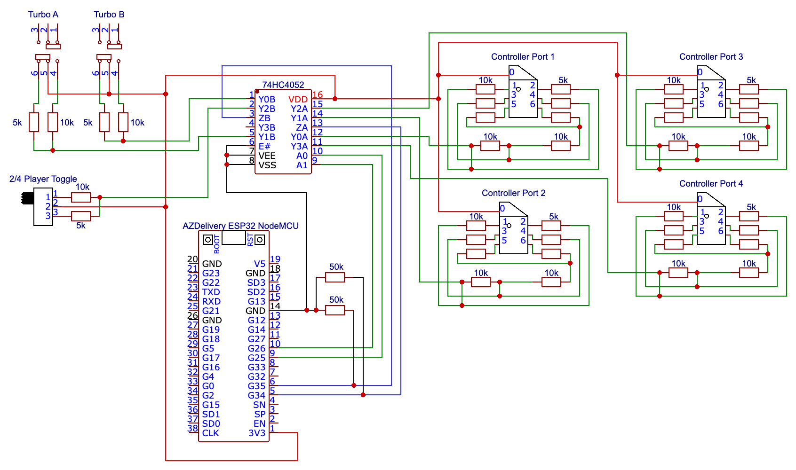
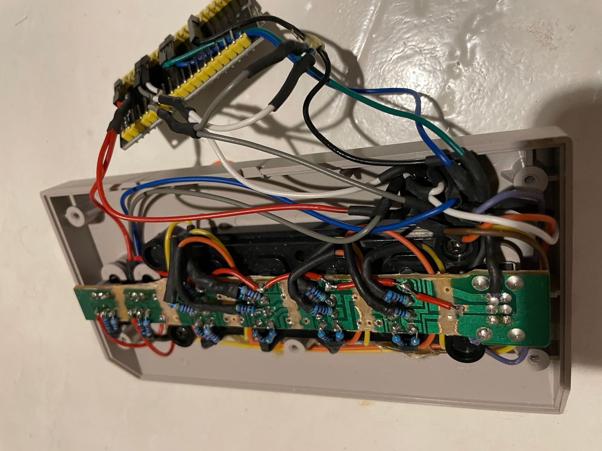
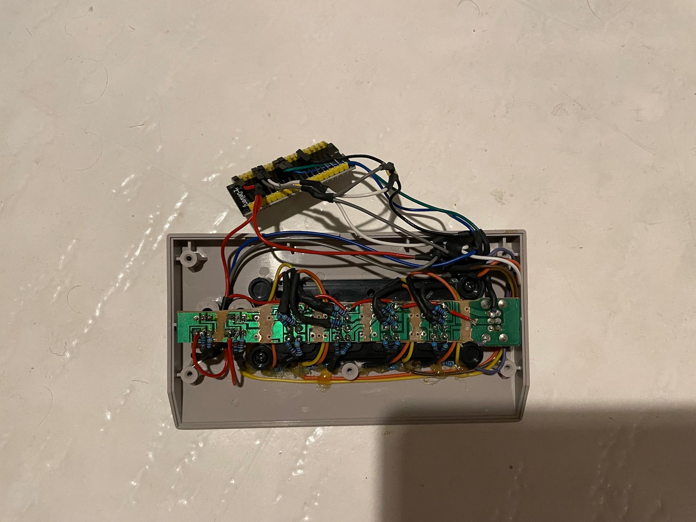
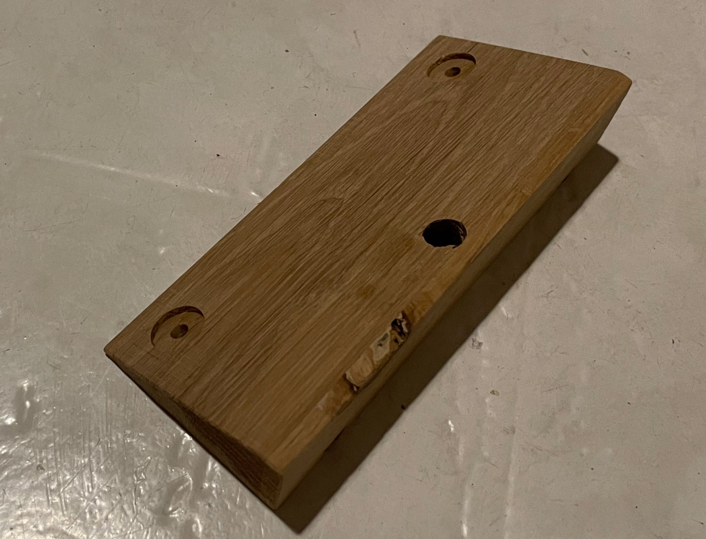
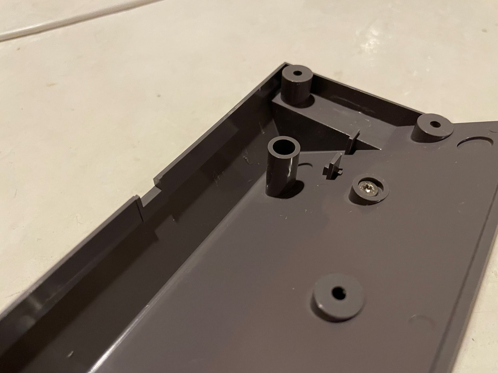
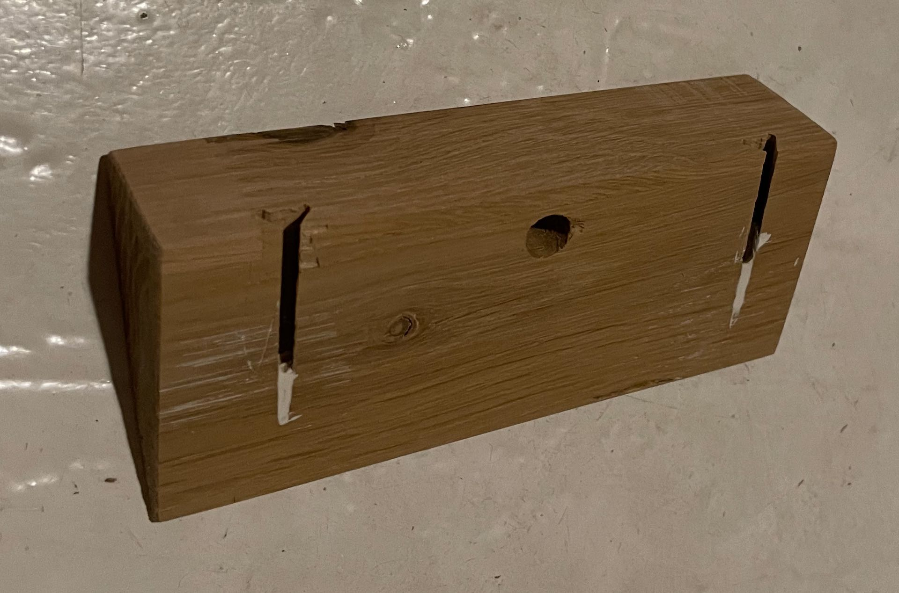

# FourScore as a (smart) key holder

Apparently this idea is [not new](https://www.reddit.com/r/gaming/comments/51hpdm/broken_nes_four_score_my_new_key_holder/). However, this project makes the key holder a bit more intelligent.

Though the use of an ESP32 and [HomeSpan](https://github.com/HomeSpan/HomeSpan) the key hanger is connected to HomeKit. The device recognizes the state of all buttons on the device, and also which ports have something in them. "Something" in this case is one of six key chains.

## Technical details
The ESP32 that where used has only 4 analogue inputs and to outputs that can be used simultaneously with the Wifi-module. This could probably be expanded with something like an I2C-device, but in this project it was sufficient to use a multiplexer (74HC4052).

Through the multiplexer, the two outputs can be used to create 2x4 separate channels for the inputs to read. This means that each controller port and button can be iterated though and read independently.

### Schematic

The final circuit is shown in the schematic above. Each controller port is connected to the voltage supply (3,3V) at pin 0. Each key chain has a bridge between pin 0 and its respective key number. When plugged in, this gives a voltage drop over the controller port based on 5k resistance for pin (player) 1, 10k for pin 2 etc. I.e 5k*N where N is the player number.

To save a little bit on resistors these are connected in series as shown in the schematic.

Each player is connected to the respective pin on the multiplexer.

A similar approach, but much simpler is used for the buttons.

### Code
Each physical device (controller port or button) is represented by a class. These don't use the `loop()` provided by HomeSpan, but instead their measuring loop is controlled by the `QueueMaster` class. The `QueueMaster` class is responsible for switching the channel on the multiplexer (by setting the output pins `LOW` or `HIGH`) and telling the instances in the queue when their channel is active.

The queuer might have subscribers that they can inform about updates as needed.

The logic for the buttons is quite simple, since the queuer subscribes to itself. This is possible since there are no additional information we want to expose to HomeKit, other than the state of the physical button.

For the players, the logic is more complex. Each controllerPort might have any of the 6 key chains connected to it but we want to expose the players as `OccupancySensor`s to HomeKit, and the controller ports as additional services within that `OccupancySensor`.

To distinguish between the two types of `ControllerPort` there is both a `ControllerPort` and a `MeasuringControllerPort`. The `MeasuringControllerPort` is the queuer and has a position in the queue corresponding to its port number. The `ControllerPort` represents the state of the physical port, but is published as sub-services to the `OccupancySensor`.

All `Player`s are subscribers to the `MeasuringControllerPort`. When a `Player` (aka. key chain) is connected, removed or moved, the player updates the state of its `OccupancySensor` and the `ControllerPort`s accordingly.

## Hardware
The goal of the project was to make the device smart, without changing the outside of the device at all. The only change needed was to drill two holes in the back of the device to be able to screw it into the mount.

Since the device is angled (30°) a mount was created to allow the device to hang straight on the wall. For this, a piece of oak was used.

<!-- 
_Back of device_ -->

_Front of device_

<!-- 
_Top of device_ -->

_Mount, side to fasten FourScore_

_FourScore with screws to connect to the stand. Note that the metal of the screws is completely hidden within the raisers in the plastic, and will be completely isolated when the device is closed back up._

_Mount, wall side. Two slots are routed out to allow for it to slide onto two screws in the wall. Plaster was used to stop the screw heads completely level with each other and the top of the device._