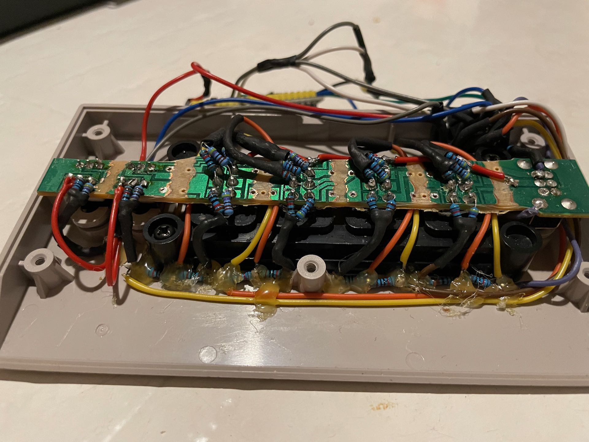
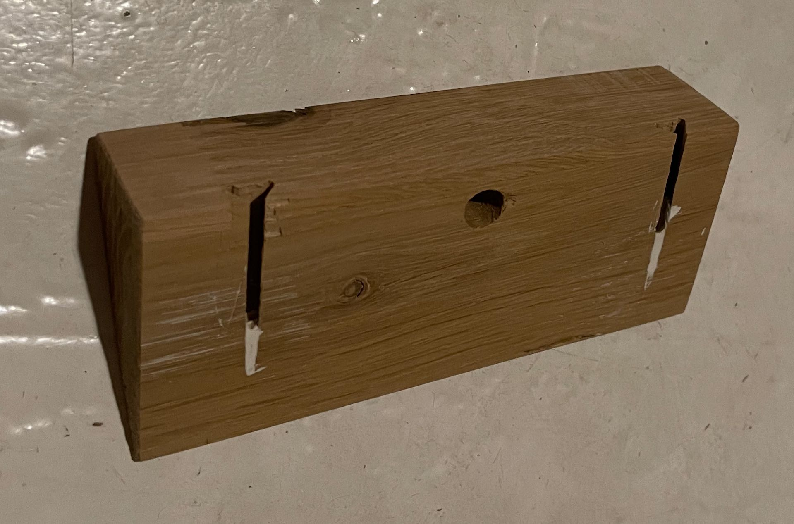
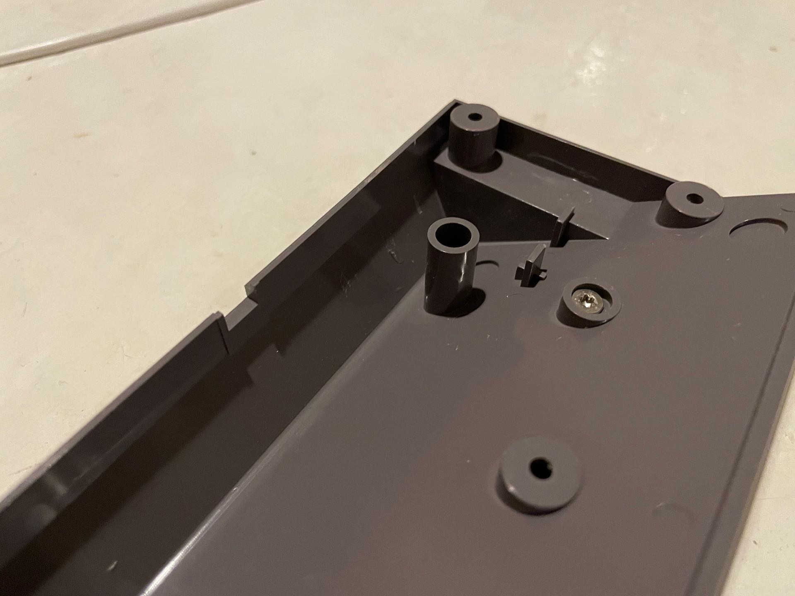

# Hardware
The goal of the project was to make the device smart, without changing the outside of the device at all. The only change needed was to drill two holes in the back of the device to be able to screw it into the mount.

Since the device is angled (30°) a mount was created to allow the device to hang straight on the wall. For this, a piece of oak was used.

## Electronics
Once the PCB is [modified](./PCB_MODS_AND_INFO.md) the new components can be mounted according to the schematics. Resistors are added as illustrated in the first image below and connected to the corresponding pins on the 74HC4052. The end result should look something like the second image (but probably a bit prettier).

_How resistors where soldered on the old pins on the device. Everything is connected thorough the 74HC4052 to the ESP32._
 
 

_Front of device_
 
 

## Wall mount
A wall mount, angled 30°, was created out of oak. Space was created for the original "feet" of the device and a hole was drilled to allow for the center screw, holding the device together, to be screwed in after the mount is fixated to the device.

The screws holding the device to the mount where places where they cant accidentally short any of the components within the device (shown in the third image below).

_Mount, side to fasten FourScore_
 
 

_Mount, wall side. Two slots are routed out to allow for it to slide onto two screws in the wall. Plaster was used to stop the screw heads completely level with each other and the top of the device._
 
 

_FourScore with screws to connect to the stand. Note that the metal of the screws is completely hidden within the raisers in the plastic, and will be completely isolated when the device is closed back up._
 
 