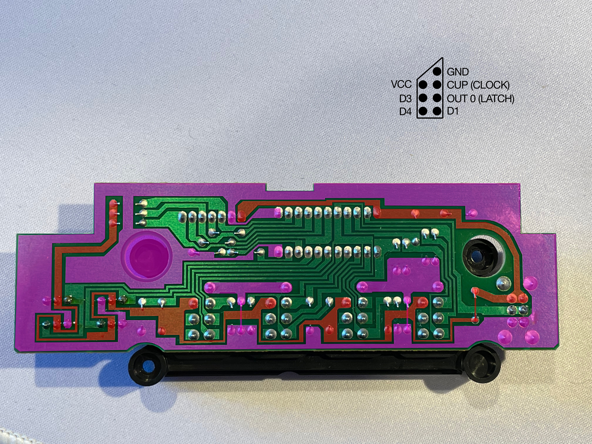
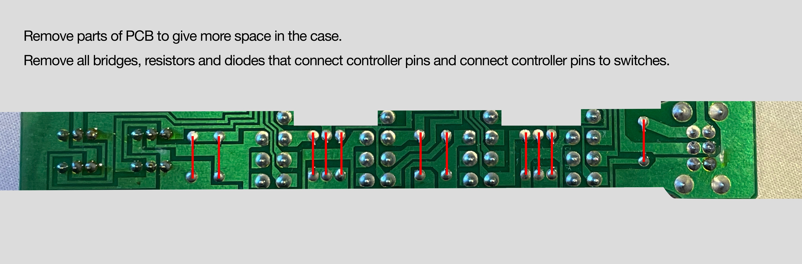
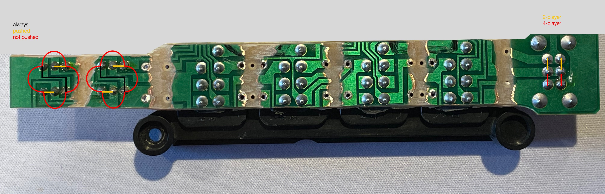

# Information about original PCB and PCB modifications
On this page you can find information about the original PCB and how it was modified to allow all the new parts to fit and work.
 
 

## Original PCB

_The image shows the original PCB, where VCC is colored red and GND is colored purple. The image also shows the original mapping of one of the controller ports (viewed from solder-side)._
 
 

## PCB modifications

_To be able to fit the new parts, and to allow for the desired functionality, the PCB was modified. The modifications are shown in the image above. The greyed out pars where removed, as well as all bridges, resistors and diodes._
 
 

_In addition to the mods in the previous picture some of the copper on the PCB was also removed, as shown in this image. This is necessary to be able to read the ports and buttons independently. The old GND paths might be possible to use for the new VCC, but it seemed easier to just take it all out._

_The image also shows how the pins of the buttons and toggle switch are connected in their different states._
 
 